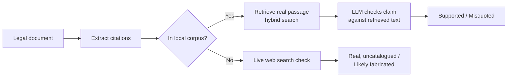

# Citation Integrity Checker

A pipeline that checks every case citation in a legal document against the real case text — catching fabricated citations and misquoted holdings before a filing goes out.

**[View the live results →](https://Aman07091004.github.io/AI-Hallucination-Citation-Checker/)**

## Why this exists

AI drafting tools increasingly fabricate legal citations — cases that don't exist, or real cases cited for holdings they never made. This project builds a verification layer that catches both problems, not just the easier one:

- **Fabricated citations** — the cited case doesn't exist anywhere
- **Misquoted citations** — the case is real, but doesn't actually support the claim made about it

A citation missing from a local database isn't automatically treated as fake. Two of the real citations checked here aren't in this project's case-law corpus, and correctly clearing them (rather than false-flagging real law) is a core design goal.

## How it works



1. **Extraction** — citations are pulled out of the document and paired with the case name mentioned alongside them.
2. **Local match** — fuzzy-matched against a corpus of real case law files (OCR'd where needed for scanned documents).
3. **Retrieval** — for a matched case, hybrid search (semantic embeddings + BM25 keyword matching) finds the specific passage the document is relying on.
4. **Judgment** — an LLM checks whether that passage actually supports the claim, grounded strictly in the retrieved text rather than its own training data about the case.
5. **External fallback** — a citation not found locally gets a live web-search check before it's ever labeled fabricated, since "not in our corpus" and "doesn't exist" are different claims.

## Validated results

Run against a real test brief (58-case UK corpus, 12 citations, independently hand-verified ground truth):

| Result | Count |
|---|---|
| Supported | 6 |
| Fabricated | 3 |
| Misquoted | 1 |
| Real, but not in local corpus | 2 |

**12 of 12 verdicts matched ground truth** — including catching a citation to a real, correctly-matched case that misdescribed what the case actually held, not just the more obvious fabrication cases.

## Tech stack

| Layer | Tools |
|---|---|
| Ingestion | `pdfplumber`, `pymupdf`, `pytesseract` (OCR fallback for scanned documents) |
| Retrieval | `sentence-transformers`, `ChromaDB`, `rank-bm25` (hybrid search) |
| Verification | Perplexity API (Sonar) — dual-mode: strict-grounding for judgment, live search for existence checks |
| Classical ML baseline | `scikit-learn` — logistic regression, cross-validated |
| Testing | `pytest` |

## Project structure

```
app/
  ingestion/     PDF/DOCX loading with OCR fallback, citation extraction
  rag/           Chunking, embeddings, vector store, hybrid retrieval
  verification/  LLM proposition judgment + external existence checks
  ml/            Classical baseline classifier + evaluation
  verify_brief.py    End-to-end pipeline entry point
tests/           Full test suite, including regression tests for bugs found along the way
docs/            Static results page (this repo's GitHub Pages site)
```

## Running it locally

```bash
python -m venv venv && venv\Scripts\activate   # or source venv/bin/activate
pip install -r requirements.txt
cp .env.example .env   # add your Perplexity API key
pytest tests/ -v
python -m app.verify_brief
```

## Status

- [x] Document ingestion with OCR fallback
- [x] Citation extraction
- [x] Local corpus matching
- [x] Hybrid retrieval (embeddings + BM25)
- [x] LLM-based proposition verification
- [x] External fallback verification
- [x] Classical ML baseline (evaluated, cross-validated)
- [ ] FastAPI service
- [ ] Docker
- [ ] Cloud deployment
